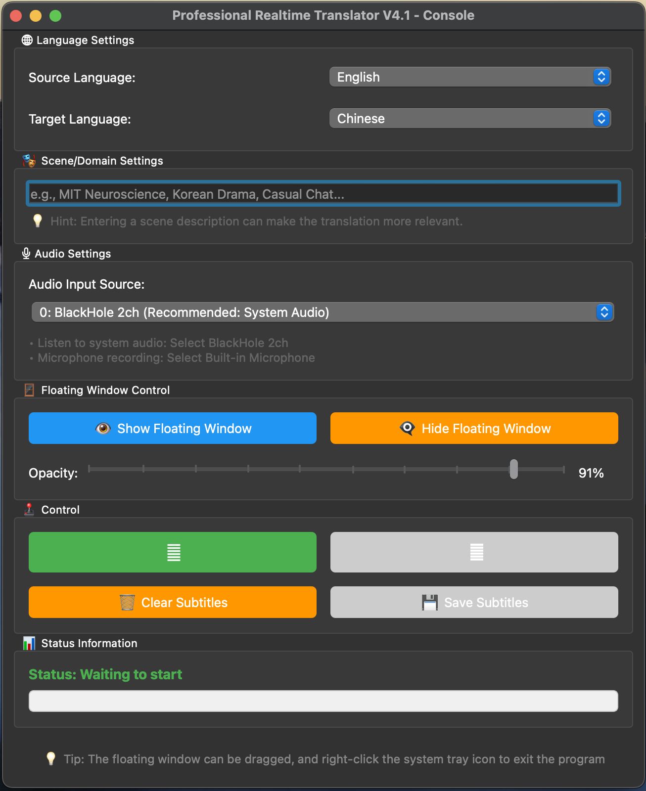
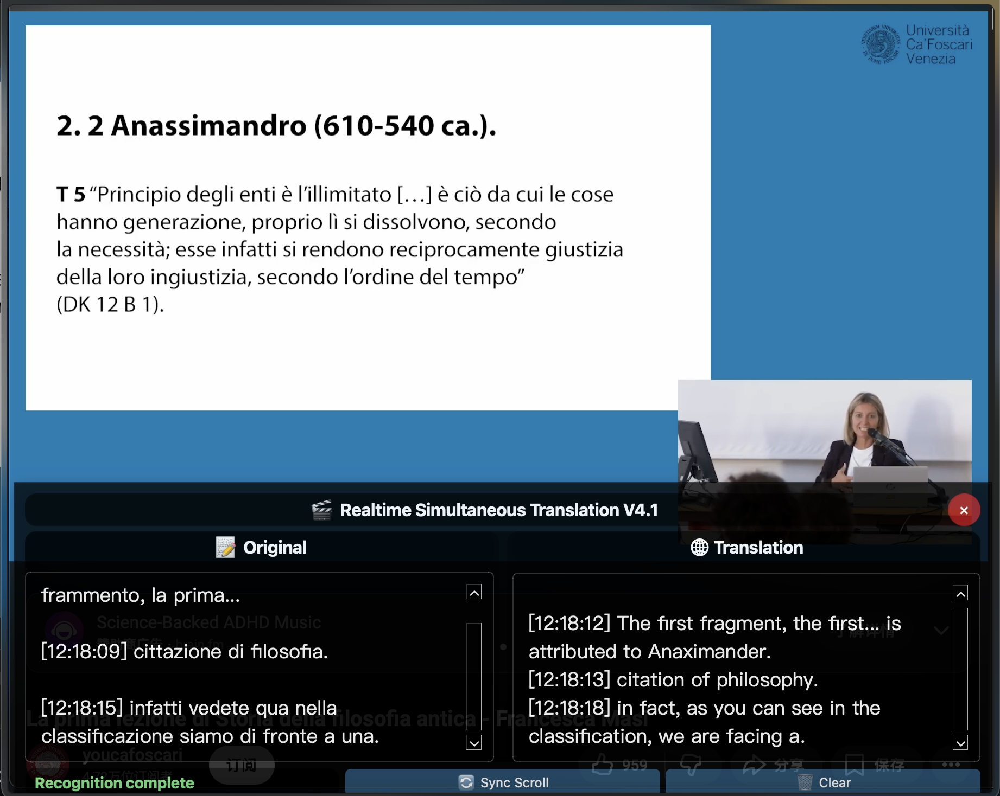

# 🎬 Offline Realtime AI Interpreter 

> **[📄 点击查看中文说明文档 (Chinese Version)](README_zh.md)**

---
<p align="center">
  
  
  
  
  
</p>

<p align="center">
  
  
</p>

## 🐱‍💻 About the Author

**GlitchyBlep** | A rather blurry black cat 🫠, coding newbie, slowly turning from pure white to… darker shades (just kidding!).

## 📖 Introduction

**Realtime Interpreter** is a completely local AI simultaneous translation tool. It can listen to system audio or microphone input in real-time, use Whisper for speech recognition, then leverage a local large language model (like Qwen) for streaming translation, and finally display bilingual subtitles in an independent, always-on-top floating window.

**Key Features:**
- 🏠 **Completely Local:** No internet connection needed, protecting your privacy and eliminating data leaks.
- ⚡ **Low-Latency Real-Time Translation:**  From speech recognition to translation output, usually within 2-4 seconds.
- 🪟 **Independent Always-On-Top Floating Window:** Translation subtitles float above all other windows, without interfering with your workflow (it can be a little temperamental, but just relaunch it if it disappears 🫠).
- 🌍 **29 Language Support:** From Chinese to Hungarian, covering most major global languages.
- 🎭 **Scenario-Specific Optimization:** Input specific domain prompts (e.g., "MIT Neuroscience," "Korean Drama," "Casual Chat") to optimize translation quality.
- 🔄 **Hot Reloading During Runtime:**  Switch languages, scenarios, and audio input sources on the fly, without restarting.

## 🏗️ Core Architecture

### Three-Thread Asynchronous Decoupling Architecture

```
Audio Capture Thread → audio_queue → Whisper Recognition Thread → text_queue → Ollama Translation Thread → UI Signal
      ↓               ↓              ↓               ↓              ↓
  Runs independently  Queue buffering   Runs independently  Queue buffering   Runs independently
```

### Key Technical Points

1. **Multi-Threaded Queue Decoupling:** Audio capture, speech recognition, and large model translation run in independent threads, communicating via queues to completely eliminate UI blocking.
2. **Forced `think=False` to Suppress Hallucinations:**  Addressing Qwen 3.5's tendency to "think too much," we forcefully disable the model's "thinking process," turning it into a ruthless translation machine.
3. **Punctuation-Based Semantic Segmentation:**  Intelligent sentence splitting based on punctuation marks (., ?, !, 。, ？, ！）to avoid semantic breaks caused by mechanical character count limitations.
4. **Anti-Swallowing Fallback Mechanism:** Force output buffer after 8 seconds of no punctuation to prevent long passages from getting permanently stuck.
5. **Sliding Window Memory:**  Keeps only the most recent sentence's context, preventing cascading errors and hallucination contagion.

## 🐛 Bug History & Evolution

### Subtitler Version - The Wooden Subtitler
- **Problem:** Single-threaded synchronous processing, UI froze like a PowerPoint, model issues.
- **Lesson Learned:** Qwen 3.5's "Thinking" process caused the translation process to hang, and subtitles couldn't be captured.

### Success Qwen2.5 Version - The First Usable Translation
- **Problem:**  Couldn't switch UI options during runtime, ghost threads, failed local saves, subtitle overflow (besides the ability to translate, everything was a mess).
- **Lesson Learned:** Whisper's auto-detection "self.language = None," "currentTextChanged" signal connected to "on_language_changed," compatibility with Qwen 3.5's "think=false" to disable thinking, punctuation integration for full sentence translation.

### V1.0 Version - Alpha Release
- **Problem:** It worked as a translator, but the output had a slightly machine-like feel, a few minor glitches, but restarting fixed everything.
- **Lesson Learned:** Added contextual reference and scenario prompts, expanded language support (29 languages in the next version), continued fixing multi-threading issues.

### V2.0 - Burst Pipe Version
- **Problem:** Translation startup process caused a hardware lockup, rigid sentence aggregation resulted in no output at all, plus a ton of minor issues (fixed the burst water pipes 🫠).
- **Fixed:** Added an anti-swallowing mechanism (buffer character limit), added UI hot switching, and refactored the underlying languages dictionary.

### V3.0 - Sausage Fragments and Hallucination Contagion Version
- **Problem 1:** Forcing a cut every 120 characters led to semantic fragmentation and a dramatic drop in translation quality.
- **Problem 2:** Qwen 3.5 got swayed by the context and started "rambling" and making stuff up🫠.
- **Fixed:**
  - Abandoned mechanical character count cutting, returning to punctuation-based semantic segmentation.
  - Refactored the prompt into an "absolute instruction" format, completely stripping away redundant context.
  - Added a translation result cleaning function to remove brackets and tags from the model's output.

### V4.0 - Transparency Slider Vanishing Bug
- **Problem:** The transparency slider made the floating window disappear.
- **Fixed:** `setWindowOpacity()` requires a floating-point number between 0.0 and 1.0, not an integer between 0 and 100.

### V4.1 - Final Stable Release
- **Problem:** Incorrect initialization order caused `AttributeError: 'ControlWindow' object has no attribute 'floating_window'`.
- **Fixed:** Ensured `ControlWindow.__init__()` first instantiated child components and then initialized the UI.
- **Additional Improvements:** Used `Qt.Tool` flag for the floating window to prevent it from being obscured by other applications on macOS (though it doesn’t really work 🫥).

## 🛠️ Troubleshooting Guide

### macOS Audio Channel Mapping Issues
```bash
# System audio capture requires the BlackHole virtual audio card
brew install blackhole-2ch

# System Preferences → Sound → Output: Select "Multi-Output Device"
# System Preferences → Sound → Input: Select "BlackHole 2ch"
# Then select the corresponding audio input device in the software
```

### Python GIL and Audio Callback Blocking
```python
# ❌ Bad Example: Performing time-consuming operations directly in the audio callback
def audio_callback(indata, frames, time_info, status):
    text = whisper_model.transcribe(indata)  # Blocking!
    translation = ollama.generate(text)      # Blocking again!
    update_ui(translation)                   # UI thread also blocked!

# ✅ Correct Solution: Queue buffering + multi-threading decoupling
audio_thread → audio_queue → whisper_thread → text_queue → translation_thread → UI_signal
```

### Qwen 3.5's Instruction Following Issues
```python
# ❌ Gentle Request (model is likely to be lazy):
"Please translate the following English to Chinese: Hello world"

# ✅ Absolute Instruction (forces obedience):
"""<|im_start|>system
You are a professional translation machine. Please strictly follow these instructions:
1. Translate from [English] to [Chinese]
2. Output only the translation result, no explanation.
3. Do not output pinyin.
4. Do not continue the conversation.
5. Do not output any punctuation or line breaks other than the translation.
<|im_end|>
<|im_start|>user
Hello world
<|im_end|>
<|im_start|>assistant
"""
```

## 🚀 Quick Start

### Dependencies
```bash
# 1. Install Python dependencies
pip install sounddevice numpy faster-whisper ollama PyQt5 scipy

# 2. Install BlackHole (macOS only, for capturing system audio)
brew install blackhole-2ch

# 3. Download the model
ollama pull qwen3.5:9b
# Or a smaller model
ollama pull qwen2.5:7b
```

### Run the Program
```bash
# 1. Start the Ollama service in one terminal (keep it running)
ollama serve

# 2. Run the translator in another terminal
python realtime_interpreter.py
```

### Configuration Steps
1. **Select Audio Input:** Choose BlackHole if translating video/conferences, or Built-in Microphone for microphone input.
2. **Select Language Pair:** e.g., "English" → "Chinese"
3. **(Optional) Enter Scenario Prompt:** e.g., "TED Talk," "Game Stream," "Medical Lecture"
4. **Click "Start Translation":** The floating window will automatically appear and display the real-time translation.

## 🎯 Usage Tips

### Best Practice Combinations
```yaml
Video Translation:
  Audio Input: BlackHole 2ch
  Language: English → Chinese
  Scenario: "YouTube Tech Review"

Conference Recording:
  Audio Input: Built-in Microphone
  Language: Chinese → English
  Scenario: "Business Meeting"

Game Streaming:
  Audio Input: BlackHole 2ch
  Language: Japanese → Chinese
  Scenario: "RPG Game Stream"
```

### Performance Tuning
```python
# Adjust these parameters in the Config class:
CHUNK_DURATION = 3.0      # Audio chunk duration (seconds), lower = lower latency, higher = more accurate recognition
WHISPER_MODEL_SIZE = "small"  # tiny/base/small/medium, larger = more accurate but slower
TRANSLATION_MODEL = "qwen3.5:9b"  # 7b is faster, 9b is more accurate
```

## 📄 License

This project is open source under the **GPL-3.0** license:

- ✅ **Allowed:** Free use, modification, and distribution.
- ✅ **Required:** Modified versions must be open source and retain the original copyright notice.
- ❌ **Prohibited:**  Privately packaging and selling commercially (Feel free to use it, and welcome donations, but selling it? Seriously, have some respect 🙏).
- 📢 **Encouraged:** If you've made improvements based on this project, please submit a Pull Request!

## 🤝 Contributing

1. Fork this repository
2. Create your feature branch (`git checkout -b feature/AmazingFeature`)
3. Commit your changes (`git commit -m 'Add some AmazingFeature'`)
4. Push to the branch (`git push origin feature/AmazingFeature`)
5. Open a Pull Request

### Future Features
- [ ] Support more local LLMs (Llama, DeepSeek, etc.)
- [ ] Export SRT subtitle files
- [ ] Hotkeys for control (Show/Hide, Pause/Continue)
- [ ] Translation history review and editing
- [ ] Customizable translation prompt templates

## 📞 Issues

Encountering problems? Follow these steps to troubleshoot:

1. **Check Dependencies:** `pip list | grep -E "(sounddevice|faster-whisper|ollama|PyQt5)"`
2. **Check Models:** `ollama list` to confirm you've downloaded the relevant models.
3. **Check Audio:** Are system sound settings correct? Is BlackHole installed?
4. **View Logs:** Error messages in the terminal are usually quite detailed.
5. **Reboot:** 🫠 "If all else fails, reboot" – sometimes it really works.

If you're still stuck, submit an issue at [Issues](https://github.com/GlitchyBlep/realtime-interpreter/issues), including:
- Operating System version
- Python version
- Complete terminal error log
- Solutions you've already tried

---

<p align="center">
  <i>Maintained by a blurry black cat and countless cups of coffee</i>
</p>
